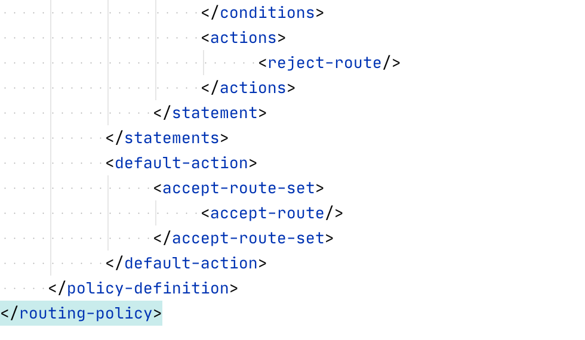
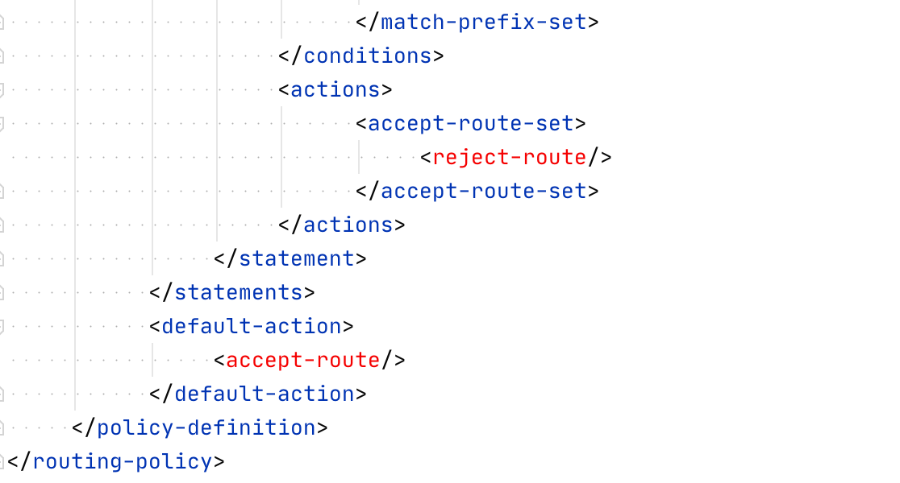
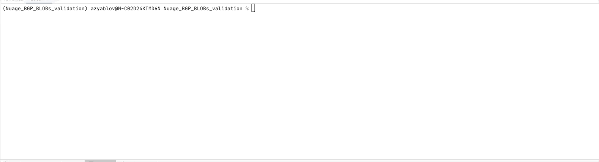

# Simple NUAGE BGP BLOG validator

Python script is using Nuage BGP schemas to validate provide BGP BLOBs.

You can validate BGP policies by using option```-p``` and BGP neighbor BLOBs by using option```-n```. 

# Usage
```
usage: nf_pg [-h] [-p] [-n] -x X

nu-bgp-blob-validator.py BGP BLOB validation

optional arguments:
  -h, --help  show this help message and exit
  -p          validate against BGP policy schema
  -n          validate against BGP neighbor schema
  -x X        XML file
```
# Example

You can find two XML files:
* my_xml_right.xml - one is correct BGP policy BLOB

* my_xml_wrong.xml - with invalid XML BLOB

The last one is not respecting XML schema.




